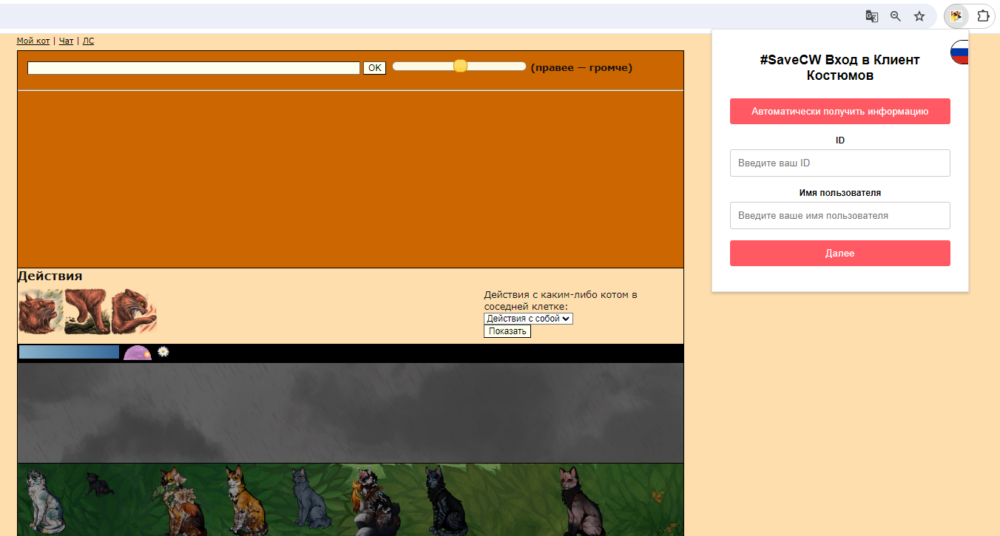
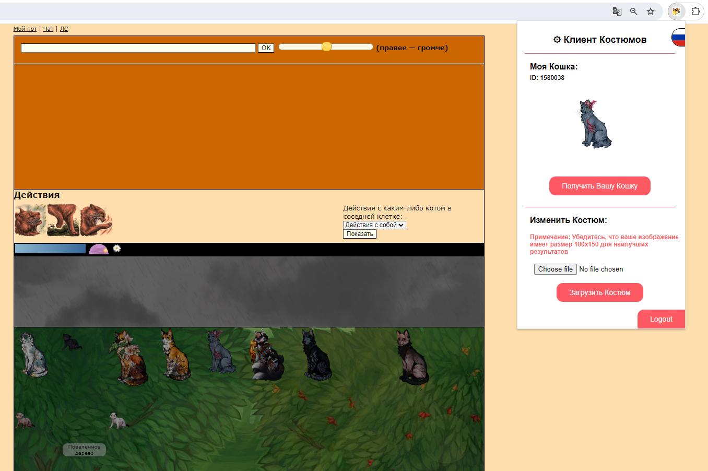

# Costume-Client Mod for #SaveCW Costumes

#SaveCW Costumes is a project by #SaveCW that allows players to create and use custom costumes in the CatWar game.   

Recent updates to the game have introduced restrictions against "unrealistic" costumes, limiting players' creative expression. Our community-developed mod allows for the use of personalized costumes. 
 

<b>Please note</b>, to see each other's custom costumes, both players must have the mod installed. This mod is purely cosmetic and does not impact gameplay.

## Installation

(Will Be added soon)

## Usage

(Will Be added soon)

## Contributing

Contributions are very welcome! Don't hesitate to open an issue or a pull request to make the mod even better!

## License

(To be added)