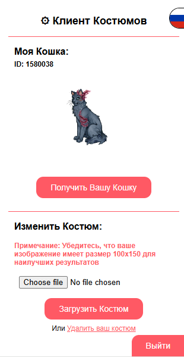

# Мод Costume-Client для костюмов #SaveCW

[English](./READMEs/README_EN.md) | [Русский](README.md)

#SaveCW Costumes — это проект от #SaveCW, который позволяет игрокам создавать и использовать пользовательские костюмы в игре CatWar.  

Недавние обновления игры ввели ограничения на "нереалистичные" костюмы, ограничивая творческое выражение игроков. Наш мод, разработанный сообществом, позволяет использовать персонализированные костюмы.
 

<b>Обратите внимание</b>, чтобы видеть костюмы друг друга, оба игрока должны установить мод. Этот мод является чисто косметическим и не влияет на игровой процесс.

## Установка

<a href="https://addons.mozilla.org/firefox/addon/costume-client/"> Дополнение для Firefox</a>

<a href="https://chromewebstore.google.com/detail/eoikjpaodcdclionodbnpmhohfjiadbo"> Расширение для Chrome</a>

## Использование

Когда вы добавите расширение в свой браузер, вы увидите новый значок в правом верхнем углу. Мод уже будет работать и показывать любые костюмы от любых пользователей, у которых установлен мод.

Вход в систему не требуется для просмотра костюмов других пользователей, но необходим для загрузки ваших костюмов.

Чтобы загрузить свой костюм, нажмите на значок расширения и войдите в систему. Вас попросят добавить ваш CatWar ID и CatWar Username.

Если хотите, вы можете нажать **"Автоматически получить информацию"**, чтобы автоматически получить необходимую информацию из CatWar!

После этого вас попросят ввести 6-значный код, который будет отправлен в ваши личные сообщения CatWar https://catwar.su/ls

После этого вы сможете загрузить свой костюм!

Если вы не видите аватарку вашей кошки на экране загрузки, вы можете нажать кнопку **"Получить вашу кошку"**, чтобы получить аватарку вашей кошки (это используется в основном для того, чтобы вы могли увидеть, как ваш костюм будет выглядеть на вашей кошке).

Чтобы загрузить костюм, нажмите "Выбрать файл" и выберите изображение вашего костюма (мы рекомендуем использовать изображение размером 100x150 для наилучших результатов).

Ниже вы увидите кнопку **"Загрузить костюм"**, нажмите на нее, чтобы загрузить ваш костюм!

После загрузки костюма вы сможете увидеть его в игре! (Если вы его не видите, попробуйте обновить страницу).

В любое время вы можете нажать кнопку **"Выйти"**, чтобы выйти из мода, если это необходимо.

## Вклад

Вклады очень приветствуются! Не стесняйтесь открывать issue или pull request, чтобы сделать мод еще лучше!

## Лицензия

Этот проект лицензирован под GNU General Public License v3.0 - см. файл [LICENSE](LICENSE) для подробностей.

## Политика конфиденциальности и Условия использования
[Политика конфиденциальности](https://cat.arisamiga.rocks/guidelines) | [Условия использования](https://cat.arisamiga.rocks/privacy)

> Этот проект не связан с CatWar или любыми его разработчиками.