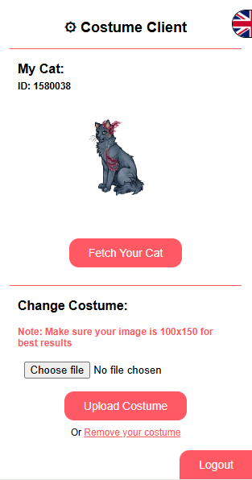

# Costume-Client Mod for #SaveCW Costumes

[English](./README_EN.md) | [Русский](../README.md)

#SaveCW Costumes is a project by #SaveCW that allows players to create and use custom costumes in the CatWar game.   

Recent updates to the game have introduced restrictions against "unrealistic" costumes, limiting players' creative expression. Our community-developed mod allows for the use of personalized costumes. 
 

<b>Please note</b>, to see each other's custom costumes, both players must have the mod installed. This mod is purely cosmetic and does not impact gameplay.

## Installation
<a href="https://addons.mozilla.org/firefox/addon/costume-client/"> Firefox addon</a>

<a href="https://chromewebstore.google.com/detail/eoikjpaodcdclionodbnpmhohfjiadbo"> Chrome extension</a>

### Manual Installation

For browsers that are not currently supported, you can manually install the extension by following these steps:

1. Go to the Releases page and download the latest version of the extension. https://github.com/SaveCW/Costume-Client/releases/latest

2. Unzip the downloaded file.

3. Open your browser and navigate to the extensions page: 

+ For Chrome, go to `chrome://extensions/`

+ For Firefox, go to `about:addons` 

+ For Edge, go to `edge://extensions/`

+ For Opera, go to `opera://extensions/`

4. Enable Developer Mode. (Mostly found on the top right corner of the page)

5. Click on "Load Unpacked" and select the folder where you unzipped the extension.

6. The extension should now be installed and ready to use!

## Usage

When you add the extension to your browser, you will see a new icon in the top right corner. The mod will work already and show any costumes from any users that have the mod installed. 

Logging in is not required to see other users' costumes but is required to upload your costumes.

To upload your costume, click on the extension icon and log in. You will be asked to add your CatWar ID and CatWar Username.

If you want you can click **"Automatically Get info"** to automatically get the required info from CatWar!

Once you have done that you will be asked to add a 6-pin code which will have been sent to your CatWar PMs https://catwar.su/ls

Once you have done that you will be able to upload your costume!

If you don't see your cat's avatar in the upload screen, you can click on the **"Fetch Your Cat"** button to get your cat's avatar (This is used mostly for you to see how your costume will look on your cat)

To upload a costume you should click on "Choose File" and select the image of your costume (We recommend using a 100x150 image for the best results)

Below you can see the **"Upload Costume"** button, click on it to upload your costume! 

Once you have uploaded your costume you will be able to see it in the game! (If you don't see it, try refreshing the page)

At any time you can click on the **"Logout"** button to log out of the mod if you need to do so.

## Contributing

Contributions are very welcome! Don't hesitate to open an issue or a pull request to make the mod even better!

## License

This project is licensed under the GNU General Public License v3.0 - see the [LICENSE](LICENSE) file for details.

## Privacy Policy and Privacy Policy
[Privacy Policy](https://cat.arisamiga.rocks/guidelines) | [Terms of Service](https://cat.arisamiga.rocks/privacy)

> This project is not affiliated with CatWar or any of its developers.
